# HW1

## 1. Preprocessing and Quality Control
### b. 线粒体比例的作用

在细胞死亡或出现破损时，随着细胞膜的破碎，细胞质中的mRNA会被释放出细胞而流失，但线粒体中的mRNA通常能够保留在线粒体结构内。因此低质量的细胞（死亡或破损细胞）会出现线粒体基因含量高的特征。

### c. QC前后的nFeature_RNA, nCount_RNA与percent.mt

指标的含义：
- `n_genes_by_counts` / `nFeature_RNA`: 每个细胞检测到的基因数量
- `total_counts` / `nCount_RNA`: 每个细胞的总UMI/reads数
- `pct_counts_mt` / `percent.mt`: 线粒体基因表达百分比
在原文章中，methodology部分有：
“cells with a very small
library size (<2,500) and a very high (>0.15) mitochondrial genome transcript ratio were removed”

下面是QC前后的nFeature_RNA, nCount_RNA与percent.mt的分布图：

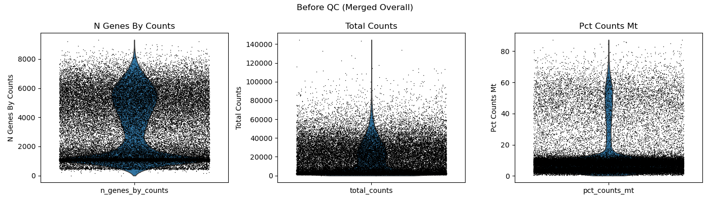


## 2. Batch Effect Removal
### a. 使用Harmony去除batch effect
文章中使用的方法为Mutual Nearest Neighbor (MNN)，这是由于文章的预处理流程依赖于Monocle3。这个方法会在局域中寻找最近邻，因此在处理不同batch间相似性/重合较高时会较有优势。此外，它会强制对齐批次，并且会给出一个“修正后的表达矩阵”，这可能会导致信息的丢失。

我希望使用课上教的Harmony算法，它与scanpy的流程是十分契合且匹配，并且速度上具有优势。Harmony 通过迭代过程逐步减少批次效应，因此Harmony在处理连续轨迹时能很好的保存这部分信息，这对于后续进行轨迹分析有优势。

在实际操作中，

### b. UMAP/t-SNE在QC前后
如图所示，在harmony之后UMAP和t-SNE图中均显示样本差异被明显的消除了。

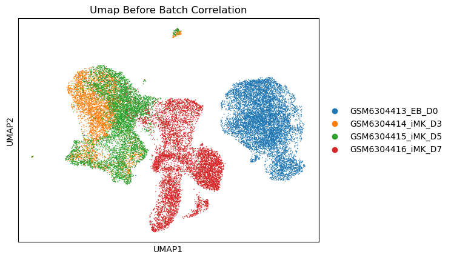
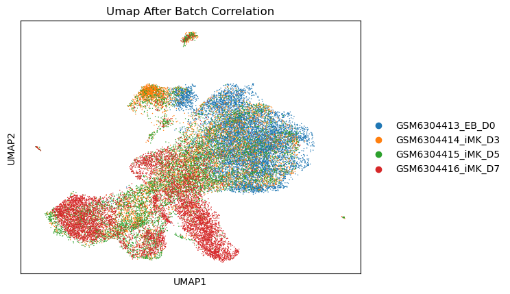

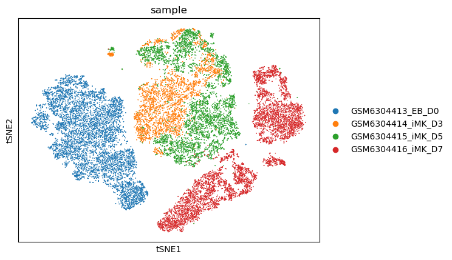
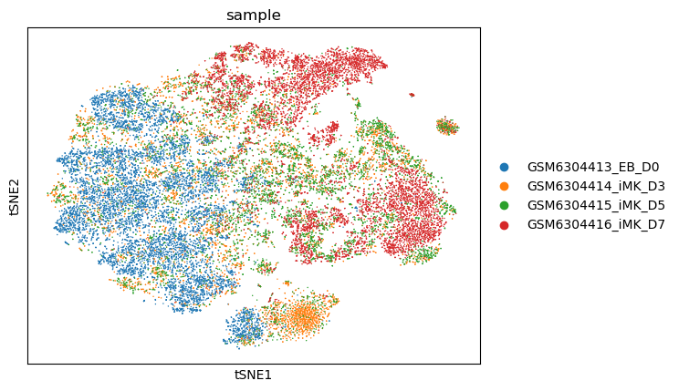

## 3. Cell Clustering and Annotation
### a. 根据figure 5e-g:
得到marker genes如下：
```python
eryth_genes = ["GYPA", "KLF1", "EPB42"]
prog_genes = ["ANXA1", "CD44", "LMO4"]
mega_genes = ["ITGA3", "ITGA6", "GP1BA", "GP9", "F2R", "CD53"]
```
并且由文章可知：
```
  # 伪代码逻辑
if eryth_genes == "高":
    cluster = "C1"
elif eryth_genes == "中" and prog_genes == "上调":
    cluster = "C2"
elif prog_genes == "高":
    cluster = "C3"
elif mega_genes == "高" and eryth_genes == "低":
    cluster = "C4 or C5"  # 需要CD53进一步区分, C5的CD53高
```
leiden之后绘制不同cluster各个marker表达水平的dotplot，根据上面的逻辑将它们分配至不同的cell type完成了cell type annotation，cluster的dotplot如下

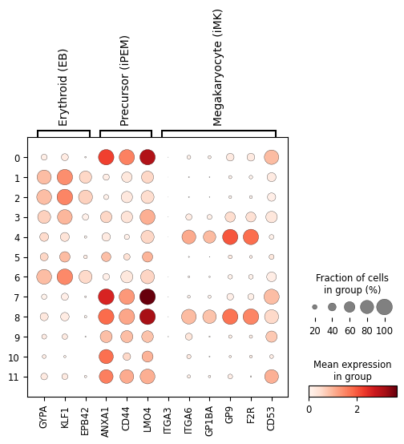


### b. t-SNE/UMAP with cell type annotations

之后绘制cell type的 t-SNE/UMAP，如下图所示

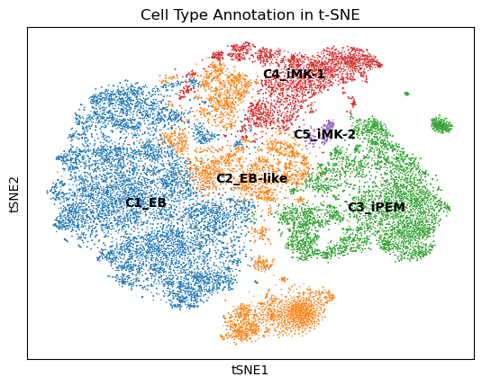


与原文章相比，原文的C4/C5，C3的分隔更明显，类似于两个分支，我的结果基本类似但显得更混在一起。我猜测可能原文使用monocle的分析方式导致的，另外原文好像没有明确给出细胞类型的定义，从文章来看，我猜测它们定义的标准更复杂一些，这也会导致复现结果的差异。

### c. heatmap and violin plot for markergene expressions within clusters

绘制heatmap和violin plot，如下图所示，可以看到不同的cluster的marker gene表达水平差异明显，且遵循我们定义的逻辑。

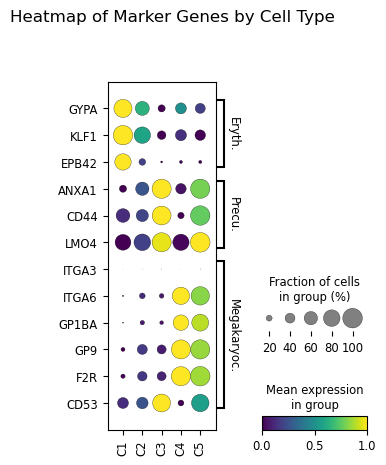

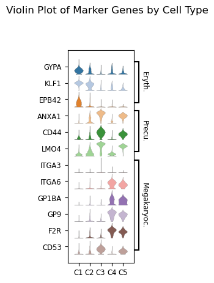

注：在原论文中的heatmap实际上是dotplot，这里为了更好地展示数据，使用了dotplot。

### d. sample proportions for each cell type cluster

绘制不同sample中cell type的比例，如下图所示。注意到与原论文的并不完全一致，但大体趋势符合时间演化的顺序。


## 4. GO Enrichment for Cell Cluster Marker Genes
选择 C1 和 C3 进行GO分析，结果如下
（使用的包为gseapy的enrichr函数，数据库为GO_Biological_Process_2023）

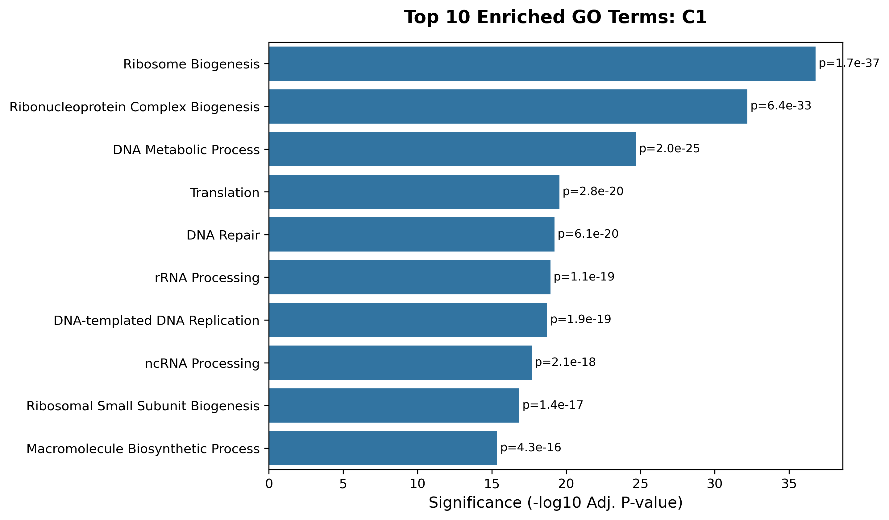
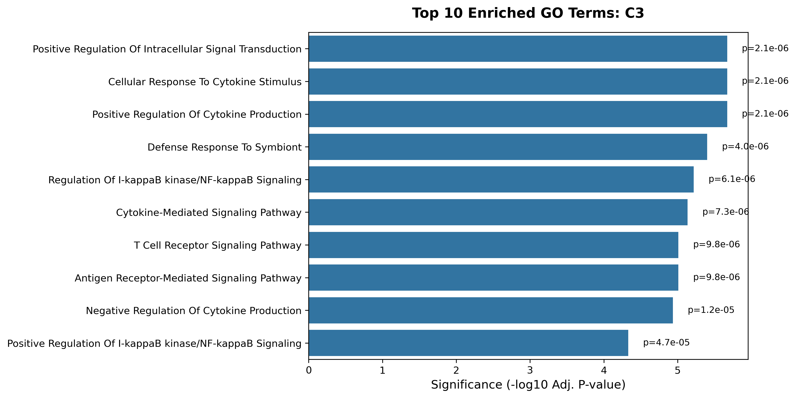

可以看到，C1期的细胞包含了很多分裂/增殖相关的通路，比如Ribosome biogenesis（蛋白合成）、RNP Compex Biogenesis、翻译、DNA复制、修复等，而C1细胞为early erythroblast-like cells，即高度增殖的早期红细胞样细胞，代表还没重编程的母细胞状态。而文章中也提到C1细胞中高表达G2/M/S相关基因，这与GO的结果高度一致。

而C3细胞的GO富集结果中出现了大量信号通路，比如NF-$\kappa$ B，细胞骨架应激等。而C3细胞为iPEM，即早期的重编程细胞，其处于重编程状态，此时细胞命运转变高度依赖于各种信号通路的调控，这与GO的结果也较为一致。

## 5. Advanced Topic

在这里，我是用原文提到的Monocle进行伪时间轨迹的分析。由于主流程是python分析，但Monocle3是R包，因此我导出了以及预处理后的adata数据后，在R中进行分析。Monocle3包的安装依据其官网的教程，在服务器中创建了名为monocle的conda环境中运行。（注意由于时间原因原文使用的是Monocle2）

由于QC，聚类，降维等步骤已经在python中完成，因此这里直接读入数据，并进行伪时间轨迹分析（为了颗粒度我在monocle中以更低的resolution做了一次clustering，不过UMAP则直接使用python处理后的）。

下面为伪时间轨迹分析的结果，基本符合从C1出发到C3/C5的过程，原文中C3与C4/C5类似于两个不同分支的终点，代表停滞在重编程处以及完成分化成为巨核细胞。不过正如刚刚提到的，在我的图中C3与C5的分支由于UMAP本身的图形结构就显得并不明显，但还是有一定的“瓶颈”处。此外，C3末端的伪时间要大于C5末端的伪时间也与文章不完全一致。

我认为造成不一致的一部分原因是由于原文MNN去batch与我使用Harmony的不同导致的，另外monocle2与monocle3的差异也可能导致了结果的不同。但总体而已，时序轨迹的起点/终点以及分叉都较为支持原文的结论。

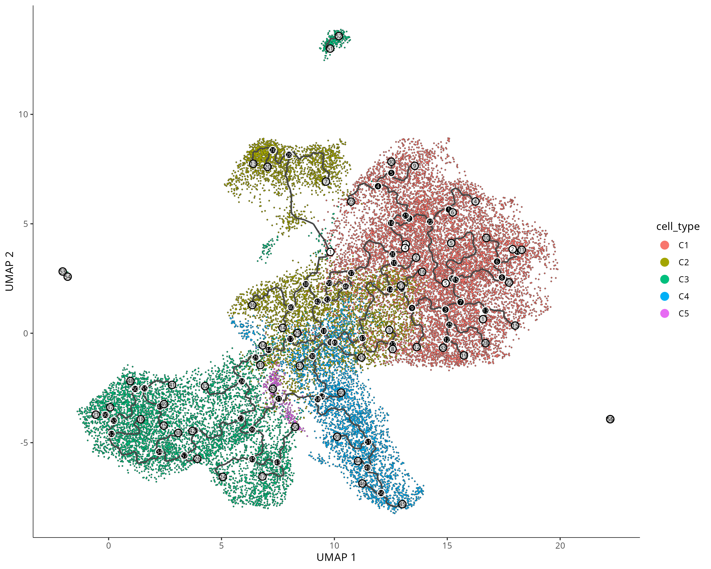

根据Cell Type的Trajectory可视化

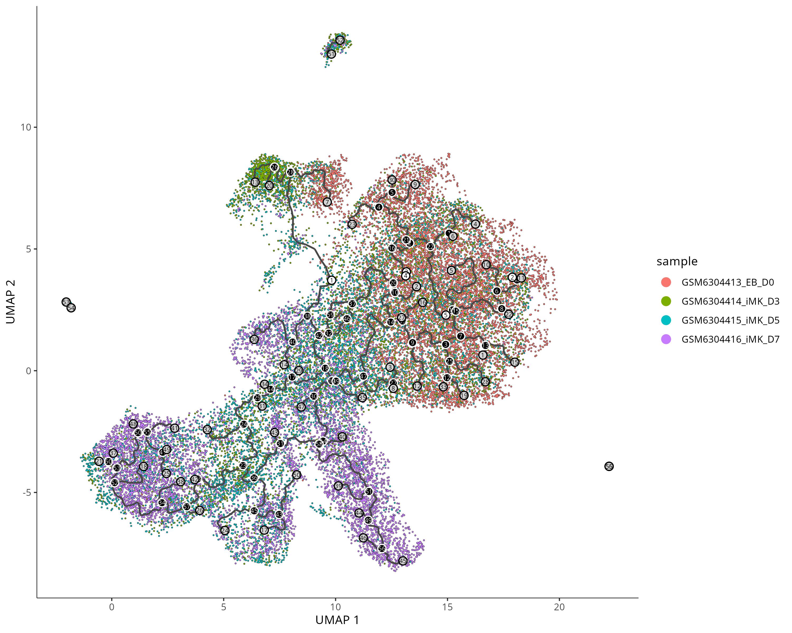

根据Sample的Trajectory可视化

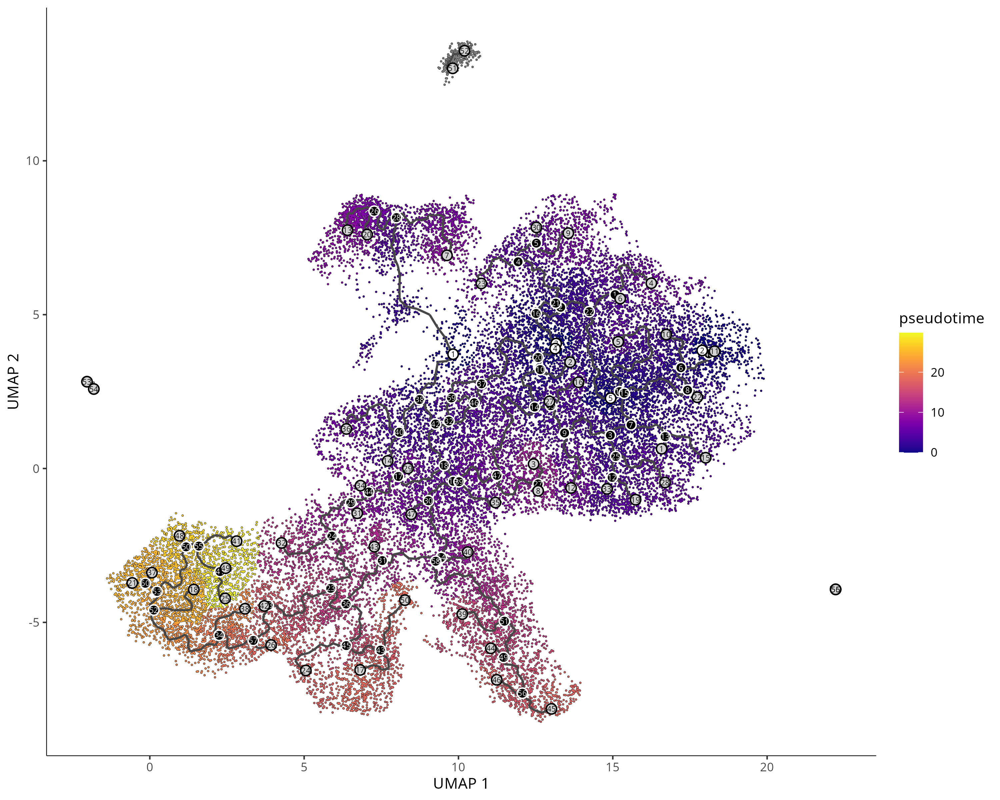

伪时间分布图

下面是各个marker gene随伪时间变化的趋势以及文章Figure 6E提到的基因，可以看到marker随伪时间的变化基本符合预期。而在Figure 6E中提到的基因，在我的分析中CDCA2与HBA2的变化趋势与原文一致，它们作为不参与到cell type annotation的基因验证了总体上的准确性。（我并没有找到IFITM3这个基因，在文章中的其他位置也没有出现过这个基因，因此略过）。不过GP9在我的分析中与文章的结果不一致，这与之前的猜测一致，表明我们细胞注释的方法不同。

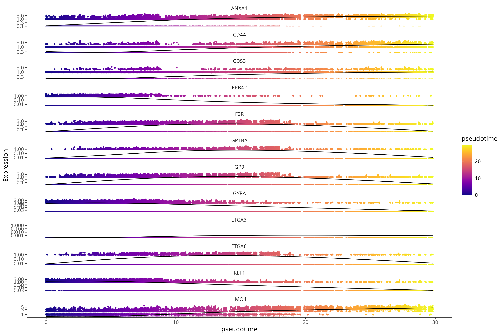

marker genes的伪时间表达变化

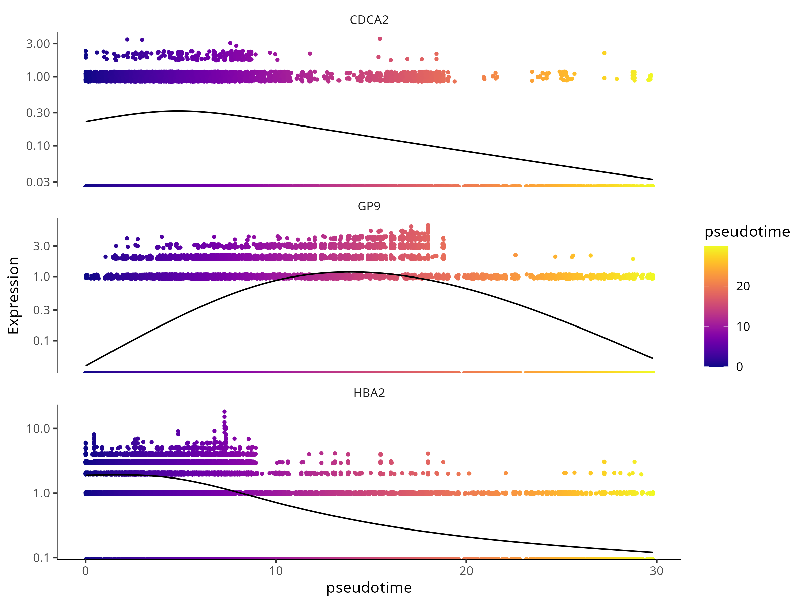

Figure 6E中出现的基因的伪时间表达变化
